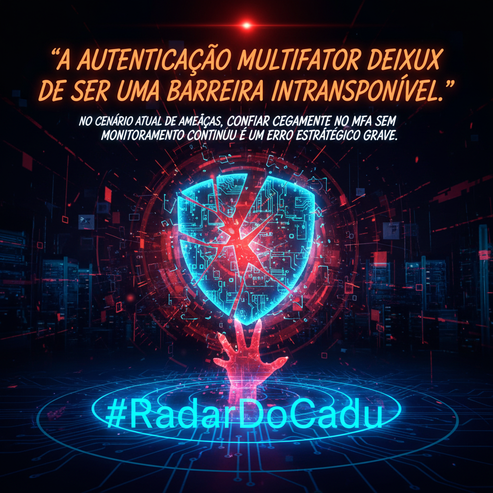

# A autenticação multifator deixou de ser uma barreira intransponível. No cenário atual de ameaças, confiar cegamente no MFA sem monitoramento contínuo é um erro estratégico grave.

- ⚠️ MFA Bypass & OAuth Abuse: Vulnerabilidades recentes na validação de TOTP permitem força bruta silenciosa em ambientes Microsoft. Somado ao abuso de 'Device Code Flow', atacantes garantem persistência via refresh tokens sem precisar da senha original.
- 🤖 Identidades Não-Humanas (NHI): Com a ascensão de Agentes de IA e Service Accounts, temos novos 'Shadow Admins'. A falta de rotação de segredos e o superprivilégio nessas contas criam vetores de ataque invisíveis aos controles tradicionais.
- 📞 O Elo Fraco do Service Desk: O alerta sobre 'Payroll Pirates' comprova que a tecnologia falha quando o processo é fraco. Atacantes usam engenharia social para resetar MFAs via telefone, contornando a criptografia mais robusta através da falha humana.

> **Insight:** No modelo Zero Trust, a emissão da credencial deve ser tão vigiada quanto o seu uso. A segurança de identidade deve evoluir do simples IAM para o ITDR (Identity Threat Detection and Response), focando em comportamento anômalo tanto de humanos quanto de máquinas.

**Seu processo de reset de credenciais exige verificação visual obrigatória ou ainda é vulnerável a uma ligação convincente? 🛡️ Repost para alertar sua rede, 👍 Like se concorda.**

`#RadarDoCadu` `#IAM` `#CyberSecurity` `#ZeroTrust` `#EntraID` `#CISO`

