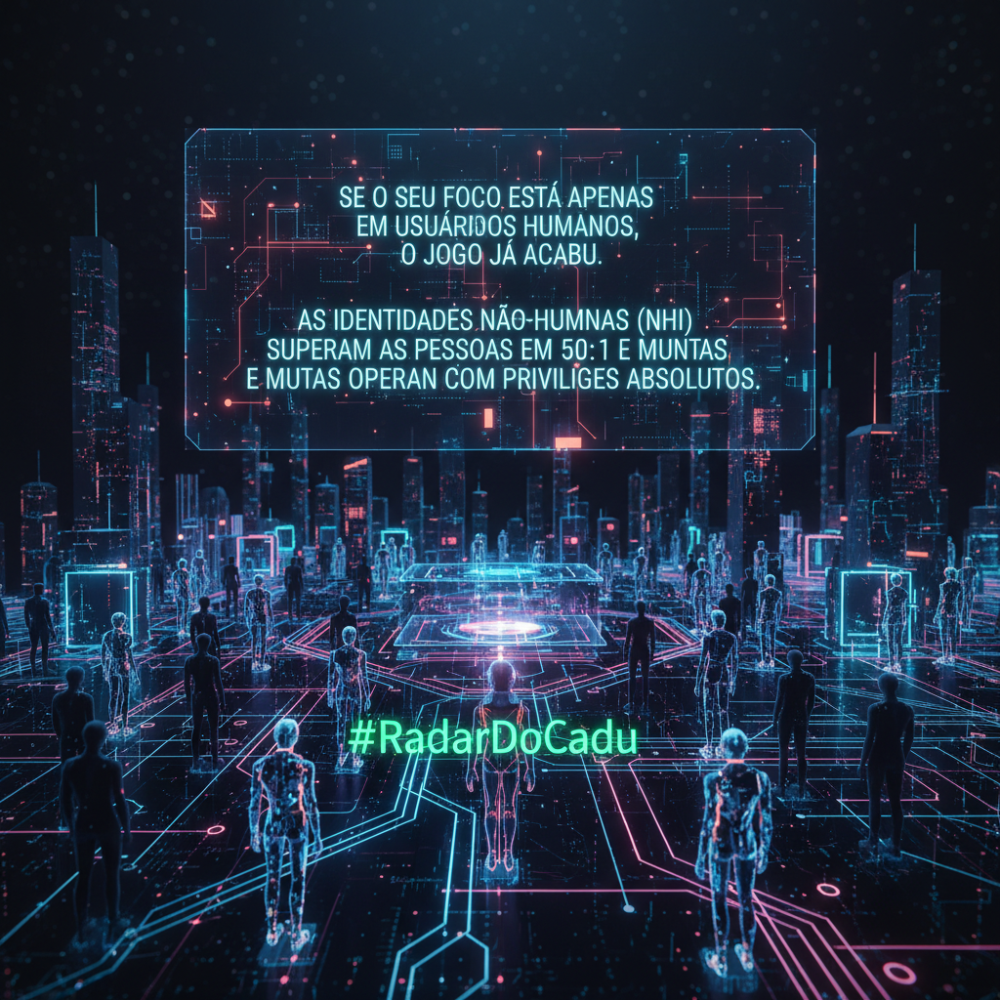

# Se o seu foco está apenas em usuários humanos, o jogo já acabou. As Identidades Não-Humanas (NHI) superam as pessoas em 50:1 e muitas operam com privilégios absolutos.

- ⚠️ **Explosão de Shadow Access:** Service Accounts e Agentes de IA tornaram-se o vetor crítico. Estima-se que 40% dessas identidades operem sem governança, criando 'highways' invisíveis para exfiltração de dados.
- 🔓 **Bypass em Federação (CVE-2025-54576):** A falha crítica no OAuth2-Proxy demonstra que o perímetro de identidade é frágil. Configurações incorretas de regex permitem que atacantes ignorem a autenticação e acessem rotas protegidas.
- 🤖 **O Risco do 'Agent ID':** Com a ascensão de Agentes Autônomos em Public Preview no Entra, a falta de políticas de Acesso Condicional específicas para máquinas transforma automações úteis em ameaças persistentes.

> **Insight:** O Zero Trust não é apenas sobre MFA para pessoas. A verdadeira fronteira de batalha está na identidade de máquina. Se você não governa o ciclo de vida dos seus Service Principals e APIs com o mesmo rigor que aplica ao CEO, seu 'novo perímetro' é inexistente.

**Quantas contas de serviço possuem permissão de 'Global Admin' ou acesso de escrita irrestrito no seu tenant hoje?

🛡️ Repost para alertar sua rede, 👍 Like se concorda.**

`#RadarDoCadu` `#IAM` `#ZeroTrust` `#NonHumanIdentity` `#CyberSecurity`

