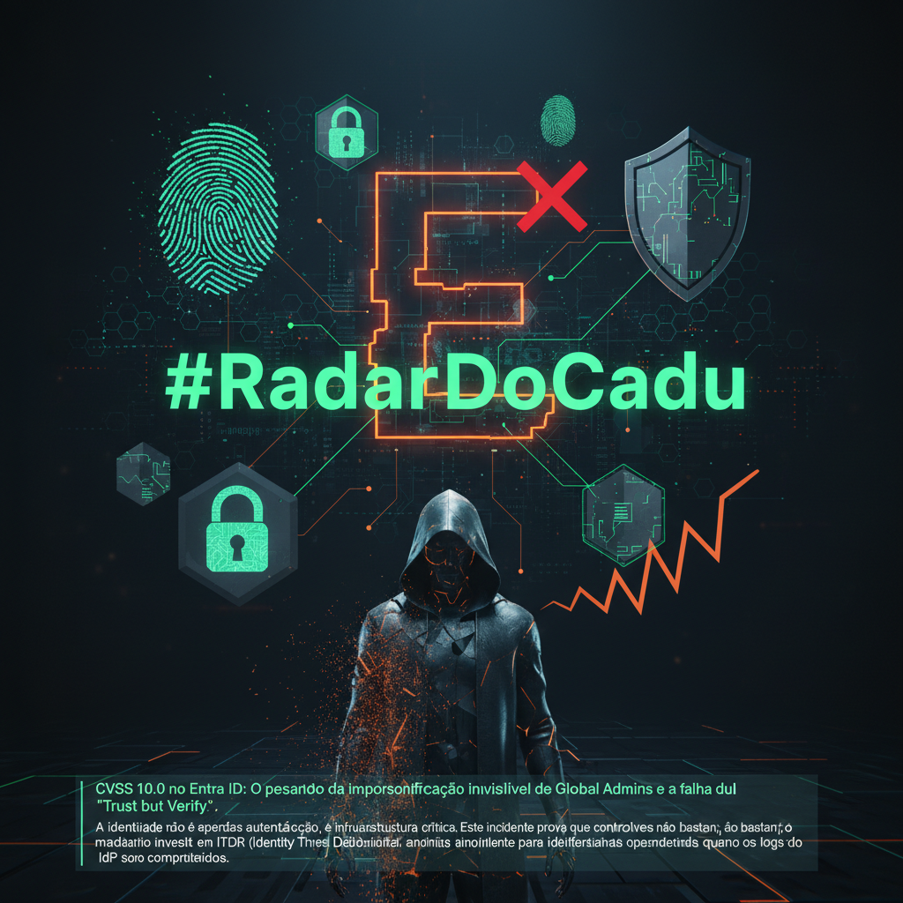

# CVSS 10.0 no Entra ID: O pesadelo da impersonificação invisível de Global Admins e a falha do 'Trust but Verify'.

- Recentemente, a vulnerabilidade CVE-2025-55241 expôs uma falha crítica de validação de token no Microsoft Entra ID, permitindo bypass completo de MFA e Conditional Access.
- O vetor de ataque possibilitava a impersonificação de qualquer usuário, incluindo Global Admins, contornando mecanismos de log nativos e eliminando rastros forenses diretos.
- Embora a Microsoft tenha aplicado a mitigação, o cenário destaca o risco de concentração de confiança no Identity Provider (IdP) como ponto único de falha.

### 💡 Insight
A identidade não é apenas autenticação, é infraestrutura crítica. Este incidente prova que controles preventivos não bastam; é mandatório investir em ITDR (Identity Threat Detection and Response) independente para identificar anomalias comportamentais quando os logs do IdP são comprometidos.

### 👇 Call to Action
Se os logs do seu provedor de identidade fossem silenciados durante um ataque hoje, qual controle compensatório alertaria o seu SOC?

#IAM #EntraID #ZeroTrust #CyberSecurity #RadarDoCadu

