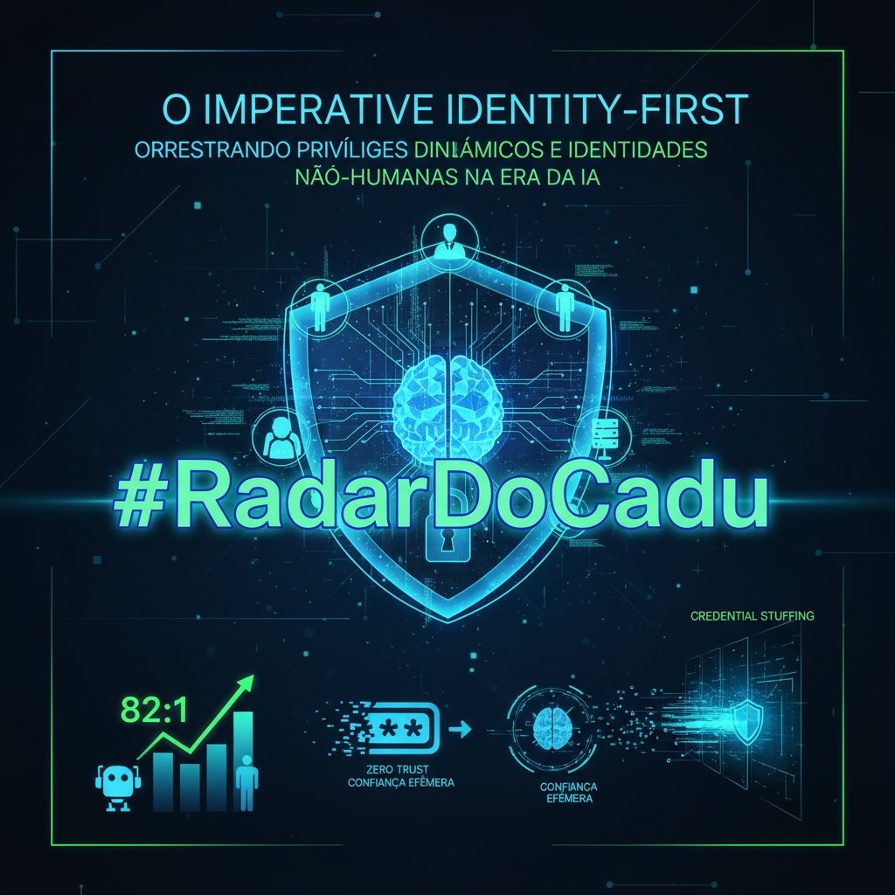

# O Imperativo Identity-First: Orquestrando Privilégios Dinâmicos e Identidades Não-Humanas na Era da IA

## Executive Summary
O paradigma de segurança cibernética sofreu uma inversão fundamental. Com a Microsoft padronizando Passkeys e a revelação de que identidades de máquina superam as humanas em uma proporção de 82:1, a identidade consolidou-se como o novo perímetro de controle absoluto. Este relatório analisa como a automação de ataques (Credential Stuffing em escala) exige uma resposta baseada em arquitetura Zero Trust, onde credenciais estáticas são substituídas por confiança efêmera e contextual.

## Strategic Context
Vivemos a erosão completa dos limites de rede. A explosão de serviços em nuvem e a integração de IA nos processos de IAM (como visto na Google Cloud) criaram um vetor duplo: a IA como ferramenta de defesa (Identity Threat Detection and Response - ITDR) e como superfície de ataque. A colaboração estratégica entre líderes de mercado (CyberArk, AWS, Ping Identity) sinaliza o fim das soluções de 'silo' em favor de plataformas convergentes que gerenciam o ciclo de vida completo (IGA, PAM e CIAM) sob a ótica de 'Least Privilege', independentemente se a identidade é um humano, um bot ou um script.

## Technical Analysis
Tecnicamente, observamos a obsolescência mandatória de credenciais de longa duração (Long-lived credentials). A adoção de FIDO2/WebAuthn (Passkeys) elimina o segredo compartilhado simétrico, mitigando vetores de Phishing e Replay. No backend, a arquitetura deve transicionar para Zero Standing Privileges (ZSP), onde o acesso não é concedido via atribuição estática de roles (RBAC estático), mas através de injeção Just-in-Time (JIT) de permissões e tokens (JWT/SAML Assertions) com TTL (Time-to-Live) curto. Identidades de máquina exigem descoberta contínua e rotação automatizada de segredos via API, tornando processos manuais insustentáveis.

## Risk Assessment
A probabilidade de comprometimento via Credential Stuffing é classificada como 'Muito Alta' devido à disponibilidade de proxies residenciais e vazamentos massivos. O impacto de identidades de máquina não gerenciadas é 'Crítico', pois frequentemente carregam privilégios elevados (Root/Admin) sem monitoramento de sessão. A ausência de governança sobre agentes de IA introduz riscos emergentes de exfiltração de dados e injeção de prompt.

## Recommendations
* Implementar FIDO2/Passkeys como padrão de autenticação primária, eliminando gradualmente o fallback para senhas e OTPs inseguros.
* Adotar Zero Standing Privileges (ZSP): Remover direitos administrativos persistentes de contas humanas e máquinas, migrando para elevação temporária baseada em contexto (JIT).
* Automatizar o Gerenciamento de Identidade de Máquina: Utilizar soluções de PAM para descoberta automática, rotação de chaves e gerenciamento de certificados para a proporção 82:1.
* Estabelecer Governança de IA no IAM: Mapear inventário de agentes de IA e restringir escopo de acesso (Scopes) para prevenir movimentação lateral automatizada.

---
### 📱 LinkedIn Condensed Version

**⚠️ 82 para 1. Essa é a proporção real de Identidades de Máquina versus Humanas no seu ambiente hoje.**

- O perímetro tradicional morreu. O novo campo de batalha é a Identidade.
- 📉 A Microsoft acaba de tornar Passkeys o padrão para novas contas (o fim das senhas começou).
- 🤖 A Google Cloud integra IA ao IAM para detectar riscos em tempo real e mitigar 'Prompt Injection'.
- 🔒 CyberArk e AWS forçam a mudança para Zero Standing Privileges (ZSP) — acesso administrativo apenas 'Just-in-Time'.
- ⚠️ O alerta da Okta é crítico: Credential Stuffing industrializado via proxies residenciais está em nível recorde.
- Se o seu IAM não cobre privilégios efêmeros e Identidades Não-Humanas, sua superfície de ataque está exposta.

💡 A era do 'Trust but Verify' acabou. Estamos na era do 'Verify Explicitly' com privilégio zero persistente. Identidade não é apenas governança; é a própria infraestrutura de segurança crítica.

👇 Sua estratégia de IAM suporta a escala 82:1 das máquinas ou você ainda foca apenas em rotação de senhas humanas? Leia a análise completa.

#RadarDoCadu #IAM #CISO #ZeroTrust #CyberSecurity #IdentityFirst
